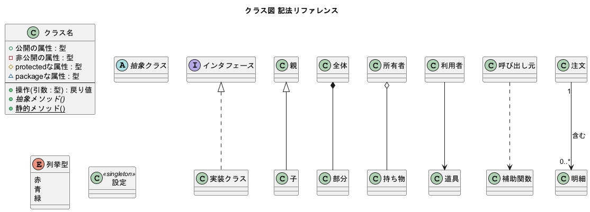

# UML × PlantUML 記法チートシート

テキストから UML 図を生成する **PlantUML** の、UML 9 種類すべての「**この記法はこう書く**」リファレンス集です。各 `.puml` は描画済みで、同名の `.png` がそのまま結果になります。



> 📝 解説記事：[Qiita『UMLをコードで書く ― PlantUML 全9図の書き方チートシート』](https://qiita.com/)（公開後にURLを差し替え）

---

## 1. 描画する方法（どれか1つ）

| 方法 | 手順 |
|------|------|
| **VS Code 拡張**（おすすめ） | 拡張機能「PlantUML」を入れて、`.puml` を開き `Alt+D` でプレビュー |
| **オンライン** | <https://www.plantuml.com/plantuml/uml/> にコードを貼り付け |
| **コマンド** | `java -jar plantuml.jar -charset UTF-8 -tpng _Template_Class.puml` → 同名 `.png` が出力（要 Java）<br>まとめて生成は `... -tpng *.puml` |

> ⚠️ `plantuml.jar` はこのリポジトリに含めていません（GPL のため `.gitignore` で除外）。[公式サイト](https://plantuml.com/download) から各自取得してください。

---

## 2. 基本ルール

```
@startuml
' 行頭の ' （シングルクオート）はコメント。図には出ない
/' 複数行コメントは
   このように囲む '/
title サンプル図
... 図の中身 ...
@enduml
```

- `@startuml`〜`@enduml` で囲む（必須）。1ファイル = 1図 が基本。
- **コメントは「行頭」の `'` のみ**。行末に `'` を書くと図にそのまま表示されるので注意。
- 日本語はそのまま書ける（コマンド生成時は `-charset UTF-8` を付ける）。

---

## 3. UML 図の分類

UML の図は「**構造**（静的）」と「**振る舞い**（動的）」に大別される。

### 構造図（モノの関係）
| 図の種類 | 何を表すか |
|----------|-----------|
| クラス図 | クラスと属性・操作・継承関係 |
| オブジェクト図 | クラスを実体化した瞬間の状態 |
| コンポーネント図 | 部品（モジュール）同士の接続 |
| 配置図 | サーバ・DB など物理的な配置 |

### 振る舞い図（動き・流れ）
| 図の種類 | 何を表すか |
|----------|-----------|
| ユースケース図 | 利用者ができること |
| シーケンス図 | 時間順のメッセージのやり取り |
| アクティビティ図 | 処理の流れ（フローチャート的） |
| 状態遷移図 | 状態の移り変わり |
| タイミング図 | 時間軸での状態変化 |

各図の実際の書き方は次節 `_Template_*.puml` を参照。

---

## 4. 記法リファレンス（`_Template_*.puml`）

`_Template_*.puml` は **「この記法はこう書く／こうできる」を一覧にしたチートシート**。
各行に「○○はこう書く」とコメントが付いており、図（`.png`）と見比べて記法を確認できる。

| ファイル | 図 | 主な記法 |
|----------|----|----------|
| [`_Template_Class.puml`](_Template_Class.puml) | クラス図 | 可視性 `+ - # ~`、`abstract`/`interface`/`enum`、継承 `<\|--`／実装 `<\|..`／集約 `o--`／コンポジション `*--`／関連 `-->`／依存 `..>`、多重度 |
| [`_Template_Sequence.puml`](_Template_Sequence.puml) | シーケンス図 | `->`同期/`-->`戻り/`->>`非同期、`activate`、`alt`/`opt`/`loop`、`note`、`==区切り==` |
| [`_Template_Activity.puml`](_Template_Activity.puml) | アクティビティ図 | `start`/`stop`、`:アクション;`、`if/else`、`repeat`、`fork`、スイムレーン |
| [`_Template_State.puml`](_Template_State.puml) | 状態遷移図 | `[*]`開始終了、`-->`遷移、複合状態、`entry/do/exit`、`<<choice>>` |
| [`_Template_UseCase.puml`](_Template_UseCase.puml) | ユースケース図 | `actor`、`usecase`、`rectangle`境界、`<<include>>`/`<<extend>>` |
| [`_Template_Component.puml`](_Template_Component.puml) | コンポーネント図 | `component [..]`、`interface`、提供/要求、`package` |
| [`_Template_Deployment.puml`](_Template_Deployment.puml) | 配置図 | `node`/`database`/`cloud`、`artifact`、接続 |
| [`_Template_Object.puml`](_Template_Object.puml) | オブジェクト図 | `object "名 : 型" { 属性=値 }`、`json` |
| [`_Template_Timing.puml`](_Template_Timing.puml) | タイミング図 | `robust`/`concise`/`binary`/`clock`、`@時刻` |

---

## 5. つまずきポイント

1. **行末コメントは不可** — `- id : int  ' 説明` と書くと `' 説明` まで図に出る。コメントは行頭の `'` で独立行に。
2. **アクティビティ図のスイムレーン `|担当|` は図の最初から** — 途中導入は `Syntax Error`。
3. **日本語の文字化け** — コマンド生成時は `-charset UTF-8` を付ける。

---

## 6. ライセンス・クレジット

- このリポジトリの `_Template_*.puml`・`*.png`・ドキュメントは **MIT License**（[LICENSE](LICENSE)）。
- 作図には [PlantUML](https://plantuml.com)（GPL）を利用。**PlantUML 本体（`plantuml.jar`）はこのリポジトリに含めていない**（`.gitignore` で除外）。各自 [公式サイト](https://plantuml.com/download) から取得すること。
